# 关系数据库

## 关系模型概述

### 关系数据结构及定义

#### 关系

*   单一的数据结构---关系

    现实世界的实体以及实体间的各种联系均用关系来表示

*   逻辑结构----二维表
    从用户角度，关系模型中数据的逻辑结构是一张二维表

*   建立在集合代数的基础上

#### 域

一组具有相同数据类型的值的集合

*   整数    实数    介于某个取值范围的整数

#### 笛卡尔积

给定一组域D1，D2，…，Dn，允许其中某些域是相同的

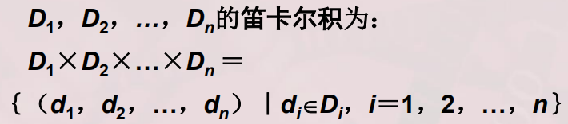

所有域的所有取值的一个**不重复**组合      **取集合**

**表示方法**

*   笛卡尔积可表示为一张二维表

*   表中的每行对应一个元组，表中的每列对应一个域

#### 元组

笛卡尔积中每一个元素（d1，d2，.…，dn）叫作一个n元组（n-tuple）或简称元组

#### 分量

笛卡尔积元素（d1，d₂，…，dn）中的每一个值di叫作一个分量

#### 基数

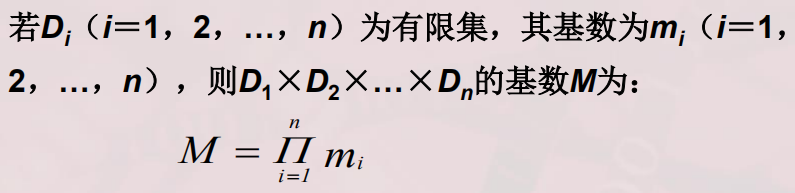

#### 关系

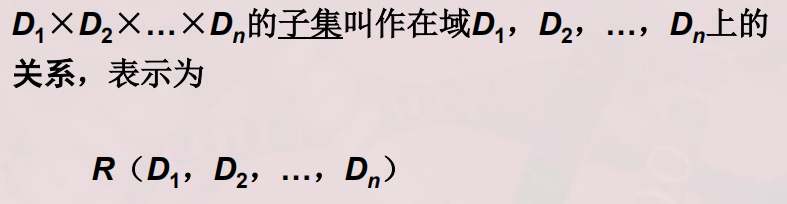

>   R：关系名
>   n：关系的目或度（Degree）

关系中的每个元素是关系中的元组，通常用t表示

*   n=1  为单元关系  一元关系
*   n=2 为二元关系
*   关系也是一个二维表，表的每行对应一个元组，表的每列对应一个域

**属性**

*   关系中不同列可以对应相同的域
*   为了加以区分，必须对每列起一个名字，称为属性
*   n目关系必有n个属性

**码**

*   候选码

    若关系中的某一属性组的值能唯一地标识一个元组，则称该属性组为候选码
    简单的情况：候选码只包含一个属性

*   全码

    最极端的情况：关系模式的所有属性组是这个关系模式的候选码，称为全码

*   主码

    若一个关系有多个候选码，则选定其中一个为主码

*   主属性

    候选码的主属性称为主属性（Prime attribute）
    不包含在任何侯选码中的属性称为非主属性或非码属性（Non-key attribute）

**三类关系**

*   基本关系（基本表或基表）

    实际存在的表，是实际存储数据的逻辑表示

*   查询表
    查询结果对应的表

*   视图表
    由基本表或其他视图表导出的表，是虚表，不对应实际存储的数据

**基本关系的性质**

1.  列是同质的

2.  不同的列可出自同一个域

    其中的每一列称为一个属性

    不同的属性要有不同的属性名

3.  列是无序的，行也是

4.  元组的候选码具有唯一性

5.  **分量必须取原子值**

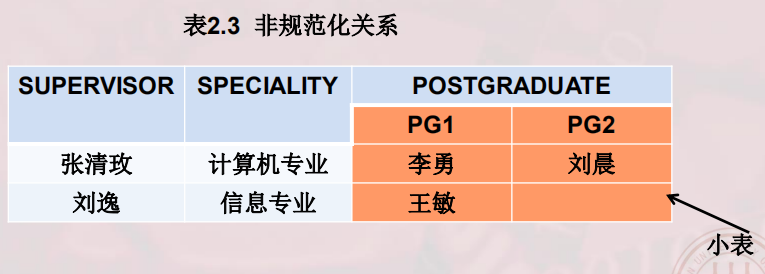

### 关系模式

是对关系的描述

**R  (U, D, DOM, F)**

*   R  关系名         表名
*   U  组成该关系的属性名集合      表的属性
*   D  U中属性所来自的域       属性类型
*   DOM 属性向域的映像集合
*   F      属性间数据的依赖关系的集合

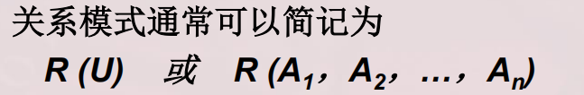

>   域名及属性向域的映象常常直接说明为属性的类型、长度

### 关系数据库

在一个给定的应用领域中，所有关系的集合构成一个关系数据库

*   关系数据库的型：关系数据库模式，是对关系数据库的描述
*   关系数据库的值：关系模式在某一时刻对应的关系的集合，通常称为关系数据库

### 关系模型的存储结构

*   有的关系数据库管理系统中一个表对应一个操作系统文件，将物理数据组织交给操作系统完成
*   有的关系数据库管理系统从操作系统那里申请若干个大的文件，自己划分文件空间，组织表、索引等存储结构，并进行存储管理

## 关系操作

**常用的关系操作**

*   查询操作：**选择，投影，并，差，笛卡尔积**，连接，除，交   前五个为基本操作
*   数据更新：插入，删除，修改

操作的对象和结果都是集合，**一次一集合**的方式

## 关系的完整性

### 三类完整性约束

**实体**完整性和**参照**完整性
关系模型必须满足的完整性约束条件称为关系的两个不变性，应该由关系系统自动支持

**用户定义**的完整性
应用领域需要遵循的约束条件，体现了具体领域中的语义约束

#### 实体完整性

若属性A为基本关系R的主属性，则不能为空

#### 参照完整性

##### 关系间的引用

在关系模型中实体及实体间的联系都是用关系来描述的，自然存在着关系与关系间的引用

引用其他元组的属性参数

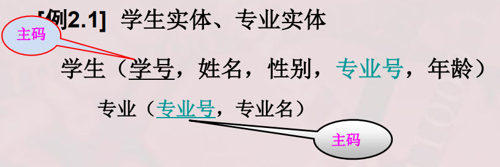

学生关系引用了专业关系的主码“专业号”

学生关系中的“专业号”值必须是确实存在的专业的专业号

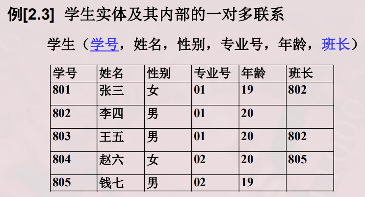

“学号”是主码，“班长”是**外码**，它引用了本关系的“学号”
“班长”必须是确实存在的学生的学号

##### 外码

设F是基本关系R的一个或一组属性，但不是关系R的码，如果F与基本关系S的主码K。相对应，则称F是R的外码

*   基本关系R称为参照关系
*   基本关系S称为被参照关系或目标关系

**例**

学生关系的 专业号  与专业关系的主码 专业号 相对应

*   “专业号”属性是学生关系的外码
*   专业关系是被参照关系，学生关系为参照关系

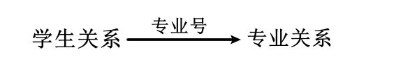

*   关系R和S不一定是不同的关系
*   目标关系S的主码K。和参照关系的外码F必须定义在同一个（或一组）域上
*   外码并不一定要与相应的主码同名
*   当外码与相应的主码属于不同关系时，往往取相同的名字，以便于识别

**参照完整性规则**

若属性（或属性组）F是基本关系R的外码它与基本关系S的主码Ks相对应（基本关系R和S不一定是不同的关系），则对于R中每个元组在F上的值必须为：

*   取空值
*   等于S中某个元组的主码值

**例如**

学生关系中每个元组的 专业号 属性只取两类值：

*   空值，未分配专业
*   非空值，专业号值

#### 用户定义的完整性

一些合理的，人性化的要求

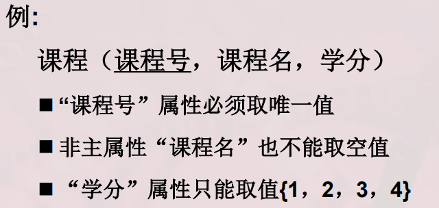

## 关系代数

*   运算对象和结果是关系

*   运算符: 集合运算符，专门的关系运算符

*   传统的集合运算是从关系的“水平”方向即行的角度进行

*   专门的关系运算不仅涉及行而且涉及列

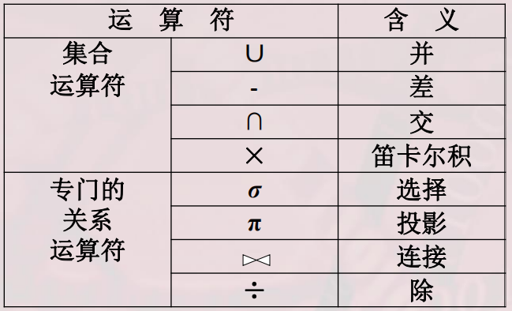

| 比较运算符     | > , >=, <, <=, =, =/ | 大于小于等于，大于等于等 |
| -------------- | -------------------- | ------------------------ |
|                | **﹁**               | **非**                   |
| **逻辑运算符** | **^**                | **与**                   |
|                | **∨**                | **或**                   |

### 传统的运算

#### 并 ∪

R,S 进行并运算的前提

*   具有相同的目n（即两个关系都有n个属性）
*   相应的属性取自同一个域

**R∪S**  仍为 n 目关系，由属于R或属于S的元组组成  **取并集**

**R∪S = {t|t∈ R∨t ∈S}**

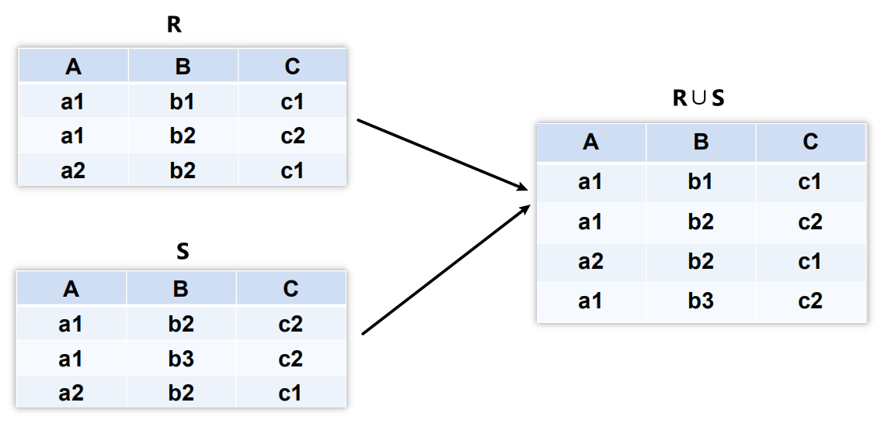

#### 差 -

R,S 进行差运算的前提

*   具有相同的目n（即两个关系都有n个属性）
*   相应的属性取自同一个域

**R - S**

仍为n目关系，由属于R而不属于S的所有元组组成  取差集

**R - S = {t|t∈R∧t/∈S}**

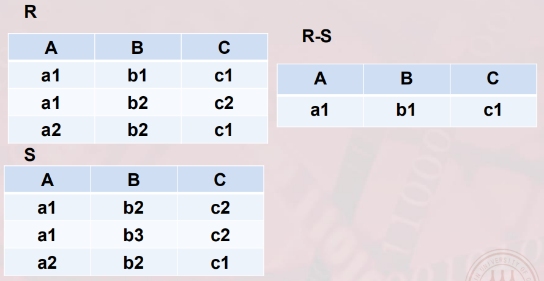

#### 交 ∩

R,S 进行交运算的前提

*   具有相同的目n（即两个关系都有n个属性）
*   相应的属性取自同一个域

取交集

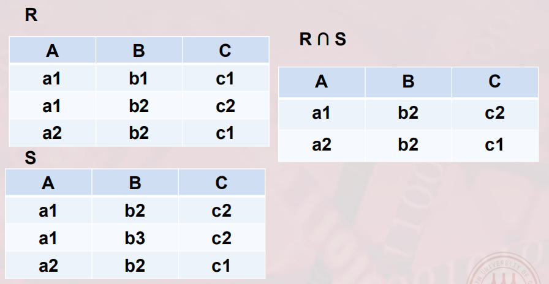

#### 笛卡尔积 X

*   R: n目关系，k个元组

*   S: m目关系，k2个元组

**R X S**

*   列：有(n+m)列

    元组的前n列是关系R的一个元组
    后m列是关系S的一个元组

*   行：k1 X k2 个元组

    

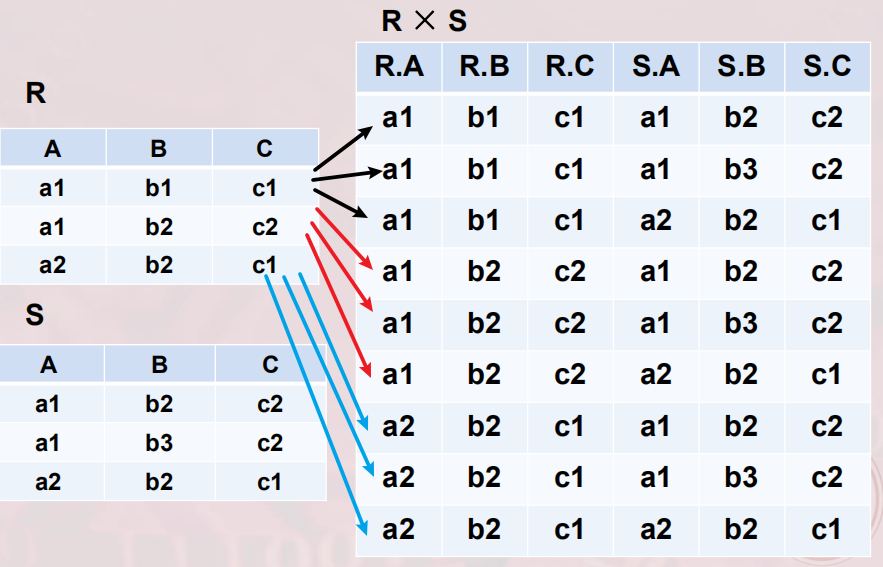

### 专门的关系运算

几个记号

**R， t∈R，t[Ai]**

设关系模式为R(A1, A2, ....., An)

它的一个关系设为R

**t∈R**  表示t是R的一个元组
**t[Ai]**  则表示元组t中相应于属性Ai的一个分量

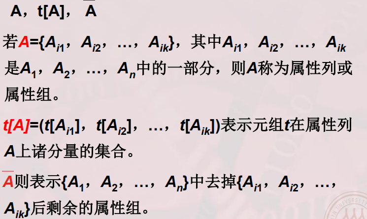

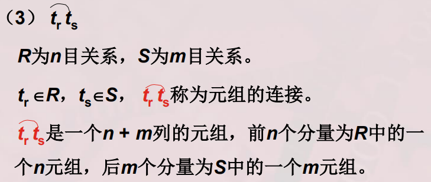

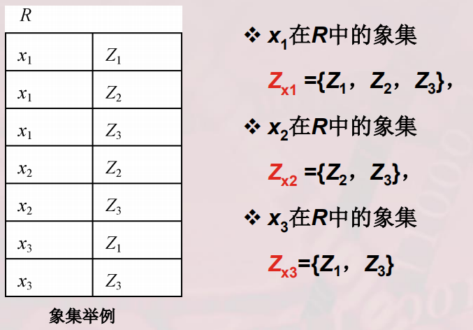

专门的关系运算有

**选择，投影，连接，除运算**

#### 选择运算

又称限制

**选择σ**

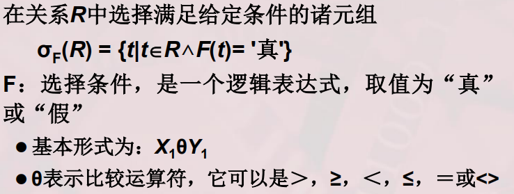

选择运算是从关系R中选取使逻辑表达式F为真的元组，是从行的角度进行的运算

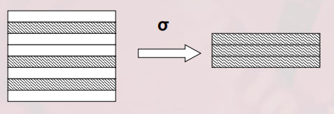

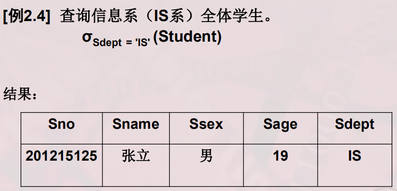

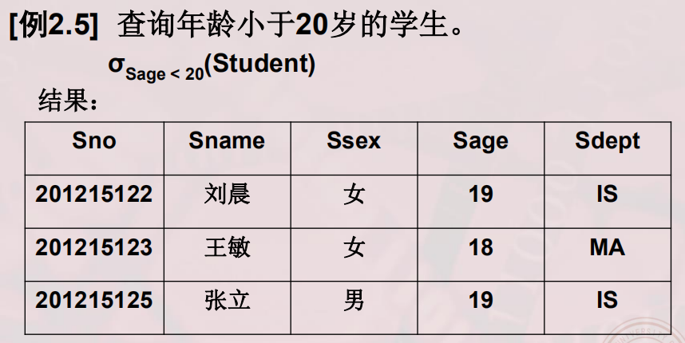

#### 投影运算∏

某种关系在某种或多种属性上的投影

对列进行操作

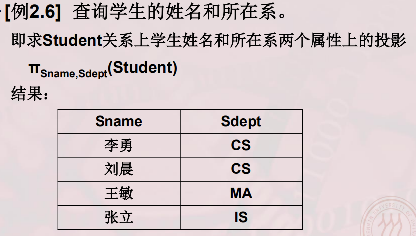

#### 连接🔗

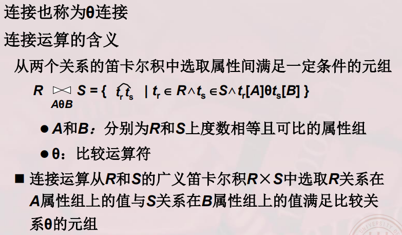

##### 自然连接

*   自然连接是一种特殊的等值连接
    两个关系中进行比较的分量必须是相同的属性组
    
*   在结果中把**重复的属性列去掉**
    
*   自然连接的含义
    R和S具有相同的属性组B

    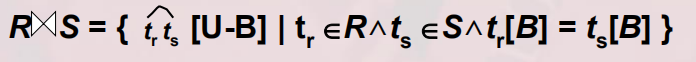

一般的连接操作是从行的角度进行运算

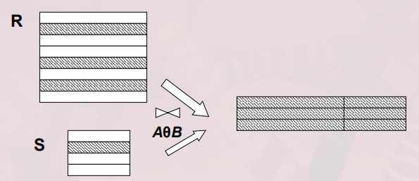

自然连接还需要取消重复列，所以是同时从行和列的角度进行运算

自然连接步骤：

*   先找到两种关系中的相等属性r
*   以属性r值较少的关系为准，决定连接后的关系行数
*   然后正常连接即可

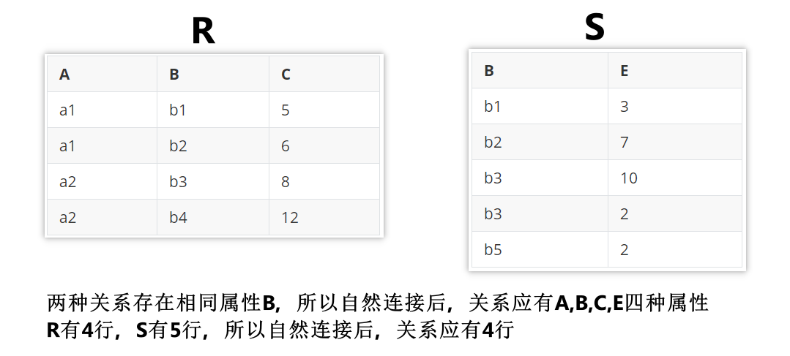

所以自然连接后的关系结果为

| A    | B    | C    | D    |
| ---- | ---- | ---- | ---- |
| a1   | b1   | 5    | 3    |
| a1   | b2   | 6    | 7    |
| a2   | b3   | 8    | 10   |
| a2   | b3   | 8    | 2    |

当θ不等于0时

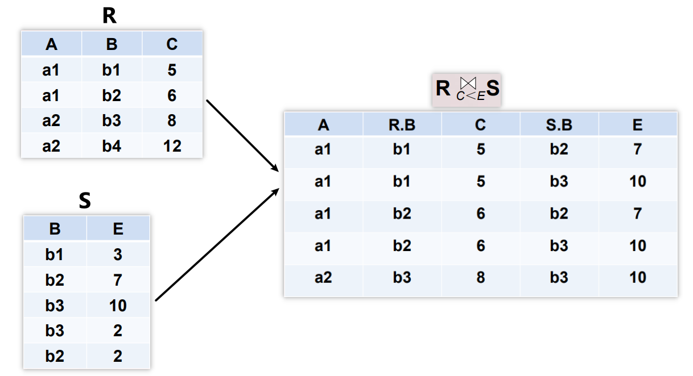

将关系R中所有属性C小于关系S中的属性E的情况都列出来

**每一行上，C 都是小于 E的**

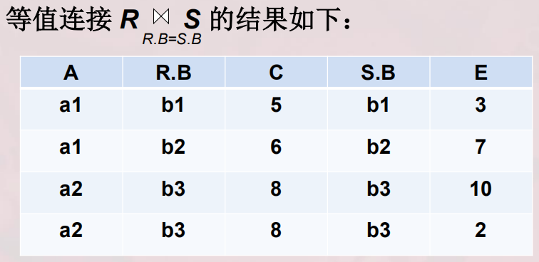

**每一行上，R.B = S.B**

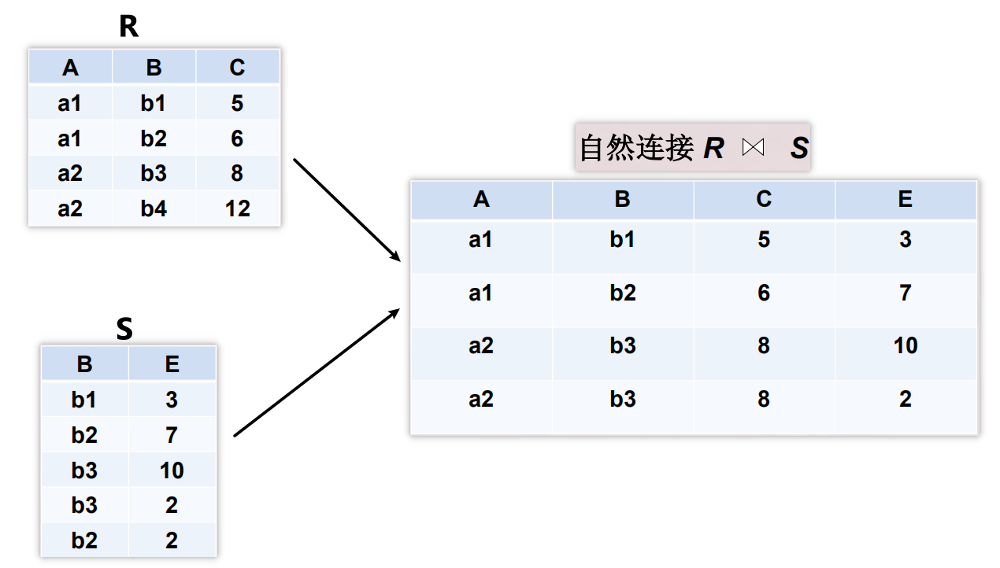

属性值必须两个关系共有，结果去掉重复的

**悬浮元组**

两个关系R和S在做自然连接时，关系R中某些元组有可能在S中不存在公共属性上值相等的元组，从而造成R中这些元组在操作时被舍弃了，这些被舍弃的元组称为悬浮元组

**外连接**

*   如果把悬浮元组也保存在结果关系中，而在其他属性上填空值（Null），就叫做外连接
*   左外连接
    ·只保留左边关系R中的悬浮元组
*   右外连接
    ·只保留右边关系S中的悬浮元组

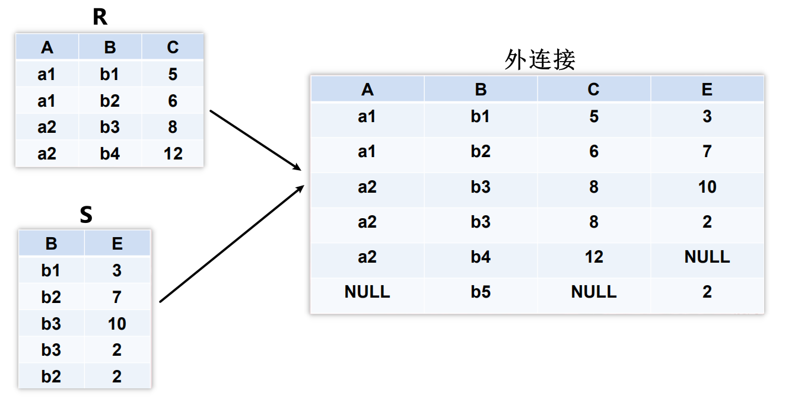

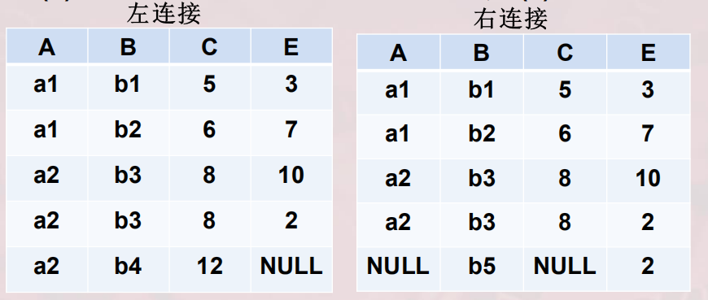

#### 除运算

**同时在列和行上进行操作**

给定关系R（X，Y）和S（Y，Z），其中X，Y，Z为属性组。
R中的Y与S中的Y可以有不同的属性名，但必须出自相同的域集。
R与S的除运算得到一个新的关系P（X），P是R中满足下列条件的元组在X属性列上的投影：
元组在X上分量值x的象集Y，包含S在Y上投影的集合，记作：

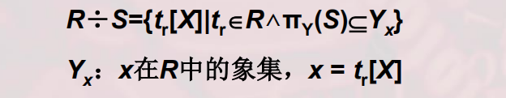

除操作是同时从行和列角度进行运算

**例题**

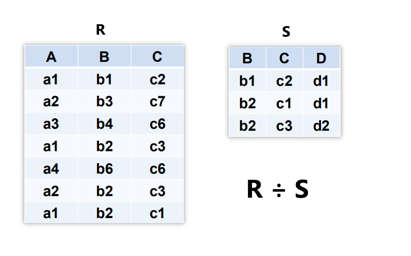

在关系R中，A可以取四个值{a1，a2，a3，a4}

*   a1的象集为{（b1，C2），（b2，c3），（b2，c1）}

*   a2的象集为{（b3，C7），（b2，C3}

*   a3的象集为{（b4，c6l}

*   a4的象集为{（bs，c6l}

    S 在（B，C）上的投影为`{（b1，c2），（b2，c1），（b2，c3）}`

    只有a1的象集包含了S在（B，C）属性组上的投影所以R÷S={a1}

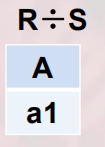